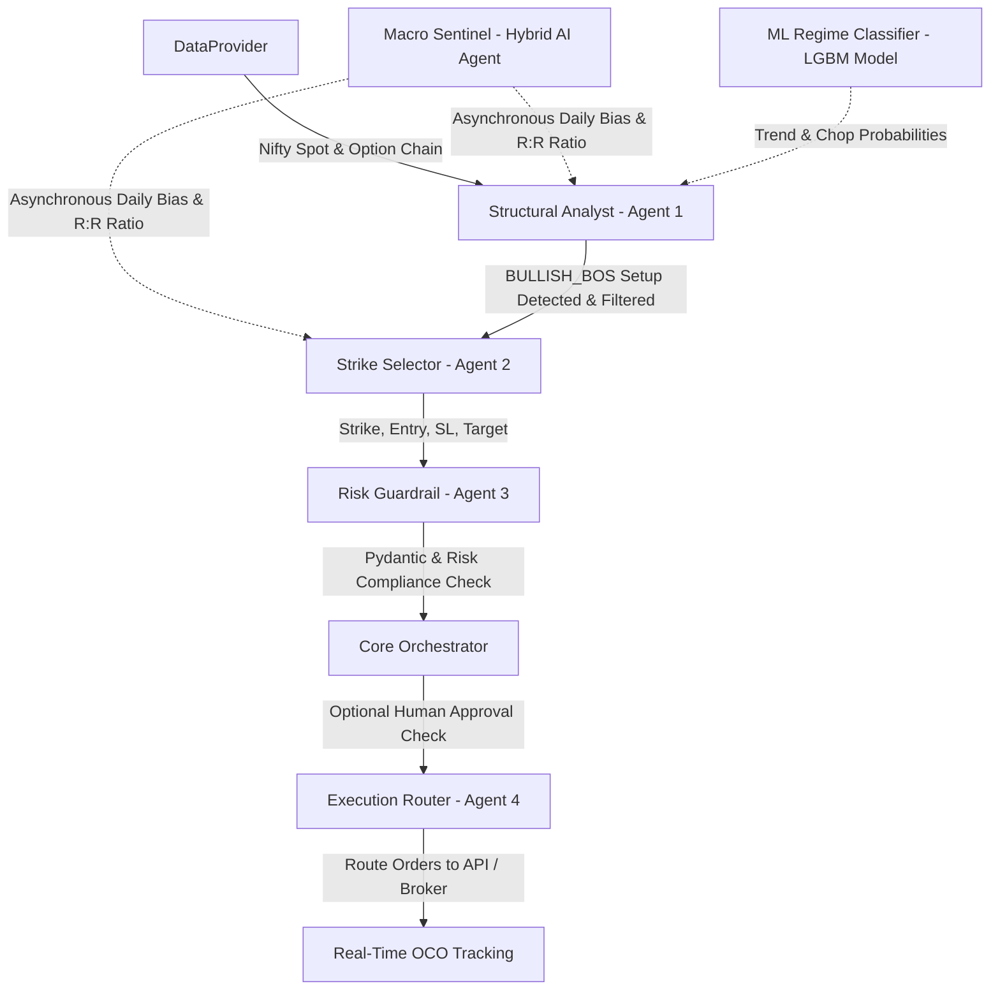

# Nifty_mcp 📈

**Nifty_mcp** is an advanced multi-agent options trading system designed to trade Nifty 50 weekly and monthly options contracts. It dynamically identifies trend regimes, sweeps market liquidity, manages dynamic reward-to-risk (R:R) setups, and performs automatic compliance and risk checks.

---

## 🏗️ System Architecture & Multi-Agent Flow

The system consists of six coordinated agents and providers working in synchrony:



1. **[DataProvider](file:///home/mcpuser/MCP/nifty-options-trader/data_provider.py)**: Real-time interface querying Yahoo Finance for spot levels and INDstocks for active option contracts and option premiums.
2. **[Macro Sentinel](file:///home/mcpuser/MCP/nifty-options-trader/agents/macro_sentinel.py)**: A Hybrid AI agent powered by GPT-4o-mini that runs asynchronously to scan Nifty news and community sentiment, generating a daily bias (`BULLISH`, `BEARISH`, `CHOPPY`) and an optimal R:R multiplier, stored in `macro_state.json`.
3. **[ML Regime Classifier](file:///home/mcpuser/MCP/nifty-options-trader/agents/regime_classifier.py)**: Computes 15 custom technical indicators on-the-fly and evaluates the current trend regime using a trained LightGBM model.
4. **[Structural Analyst](file:///home/mcpuser/MCP/nifty-options-trader/agents/structural_analyst.py)**: Analyzes structure to detect a **Liquidity Sweep** (stop hunt) followed by a **Break of Structure (BOS)**.
5. **[Strike Selector](file:///home/mcpuser/MCP/nifty-options-trader/agents/strike_selector.py)**: Chooses the nearest At-The-Money (ATM) contract (CE/PE) and calculates stop loss and target premiums based on option delta.
6. **[Risk Guardrail](file:///home/mcpuser/MCP/nifty-options-trader/agents/risk_guardrail.py)**: Validates setups against Pydantic schemas ([schema.py](file:///home/mcpuser/MCP/nifty-options-trader/schema.py)) ensuring strict risk boundaries (2% max balance risk per trade).
7. **[Execution Router](file:///home/mcpuser/MCP/nifty-options-trader/agents/execution_router.py)**: Places entry limit orders and sets up a working One-Cancels-Other (OCO) order block.

---

## 🛠️ Requirements & Installation

1. Create a Python virtual environment:
   ```bash
   python3 -m venv .venv
   source .venv/bin/activate
   ```
2. Install required packages (e.g. `lightgbm`, `pydantic`, `pandas`, `requests`, `yfinance`, etc.).
3. Configure the `.env` file with your details:
   * `OPENAI_API_KEY`: API Key for OpenAI (Macro Sentinel).
   * `INDSTOCKS_TOKEN`: JWT authorization token for the INDstocks API.
   * `TELEGRAM_BOT_TOKEN`: The API Token for your Telegram Bot.
   * `TELEGRAM_CHAT_ID`: The Telegram Chat/Channel ID where signals will be sent.

---

## 🚀 Execution Modes

### 1. Simulation / Validation Mode
Performs an automated walkthrough using pre-configured mock candles to simulate the full multi-agent flow (liquidity sweep, break of structure, entry, and target exit).
```bash
python main.py --mode sim
```

### 2. Live Market Mode
Subscribes to live feed tickers and queries current market prices during NSE trading hours.
```bash
python main.py --mode live
```
